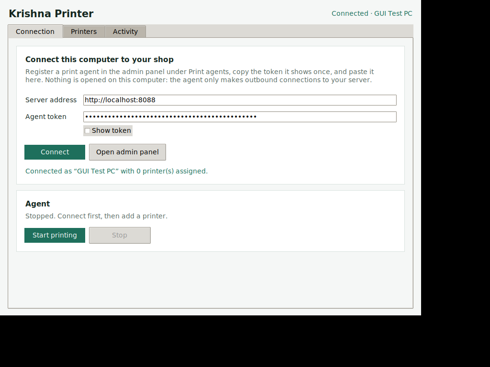
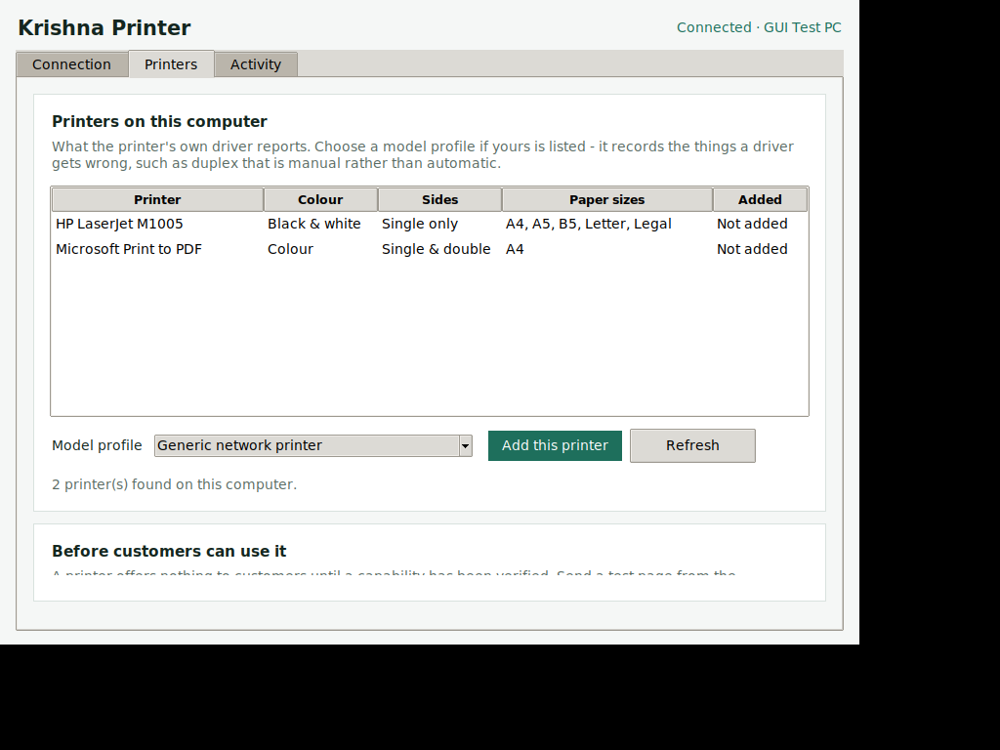

# Krishna Printer — desktop agent

A window instead of a command line. Paste the token, pick a printer, and the
shop is printing.




## What it is

The same agent that runs as a service, with a face on it. It loads
`kpms-agent.py` and drives it — the printing path, the backends, the job
handling and the refusals are all the shipping code. A second implementation
would be a second set of bugs.

| Tab | What it does |
|---|---|
| **Connection** | Server address and token. Connect, then start or stop printing. |
| **Printers** | Every printer installed on this computer, what its driver reports, and a button to add one to the shop. |
| **Activity** | What the agent is doing, live. |

## Running it

**From source**, on any machine with Python 3:

```bash
python3 agent/desktop/kpms_desktop.py
```

**As an executable**, built on Windows:

```powershell
cd agent\desktop
.\build.ps1
```

That writes `dist\KrishnaPrinter.exe` — one file, no Python needed on the
machine that runs it. PyInstaller is used at build time only; nothing it pulls
in becomes a runtime dependency.

## What it still needs on the printing machine

| | |
|---|---|
| **SumatraPDF** | Required. Windows cannot print a PDF from a script without it. `winget install --id SumatraPDF.SumatraPDF` |
| **LibreOffice** | Required for Word, Excel, PowerPoint, images and plain text — everything that is not already a PDF. `winget install --id TheDocumentFoundation.LibreOffice` |

## If the built .exe will not start

A packager reads imports statically, and the agent is loaded at runtime by
path - so nothing in the import graph mentions what the agent needs, and the
first build died on launch with `No module named 'platform'`.

`kpms_desktop.py` therefore imports everything the agent imports, and
`build.ps1` names them again as hidden imports. A check in
`tests/desktop_check.py` fails if that list and the agent's real imports ever
drift apart.

If a build still will not start, build it with a console attached so it can
say why:

```powershell
.\build.ps1 -KeepConsole
.\dist\KrishnaPrinter.exe
```

## Model profiles

The printer's own driver is asked what it can do, and that is what the list
shows. Choosing a **model profile** adds what the driver gets wrong.

This is a curated list, not a web search. What matters for charging a customer
correctly — whether duplex is automatic or manual, whether a mono model takes
an optional colour cartridge — is exactly what a search result will not tell
you reliably, and a wrong answer there is a refund. Profiles are written from
the manufacturer's published specification, and even then they are only
*declared*: nothing is offered to a customer until it has been probed from the
printer or confirmed by a test print.

## Before customers can use a printer

Adding it here is not the last step. Open the printer in the admin panel, send
it a test page, and mark what actually worked. Until something is verified the
printer offers nothing and takes no jobs — deliberately, so nobody pays for
double-sided on a printer that cannot do it.

## Where settings are kept

The token and server address go in `config.json`. The app prefers the
machine-wide file the service installer uses, so a window and a service share
one setup:

```
C:\ProgramData\KrishnaPrinter\agent\config.json
```

That file is locked to Administrators and SYSTEM, which is right for a file
holding a token — and means an ordinary user cannot write it. When that
happens the app saves to your own account instead, and says so:

```
%LOCALAPPDATA%\KrishnaPrinter\agent\config.json
```

No Administrator prompt either way. It reads both, so a setup made by the
installer is picked up by the window and the other way round.

## Security

- The token is a credential. It is stored in `config.json` next to the agent,
  readable by administrators only, and shown as dots in the window.
- The agent only makes **outbound** connections. No port is opened on this
  computer and no printer is exposed.
- Plain HTTP is refused outright, except to a loopback address for a local
  trial.
